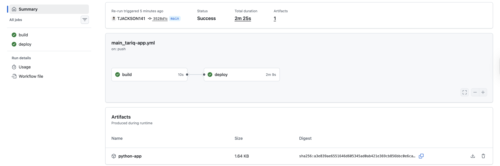
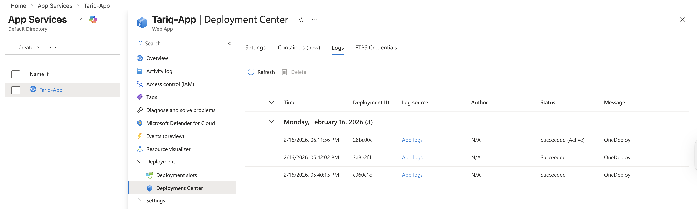
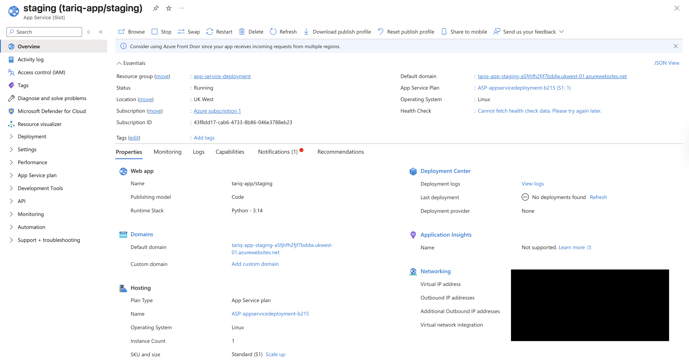
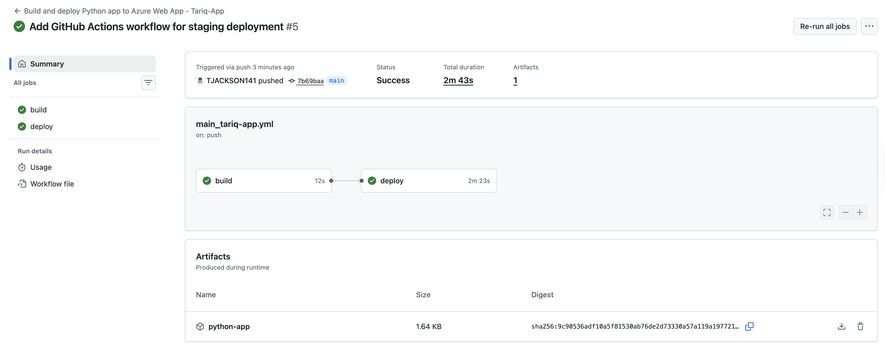
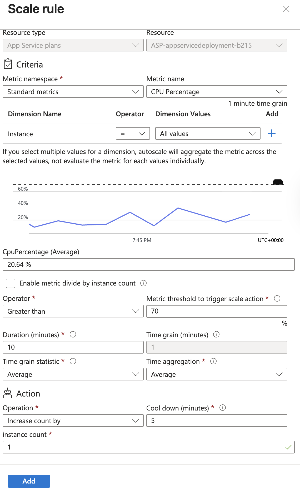
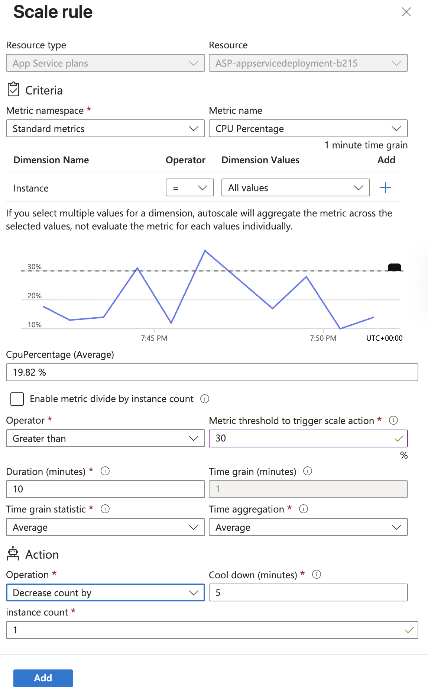
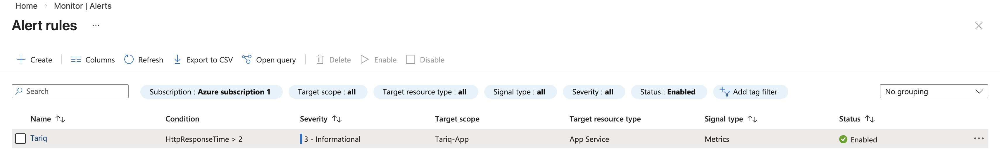
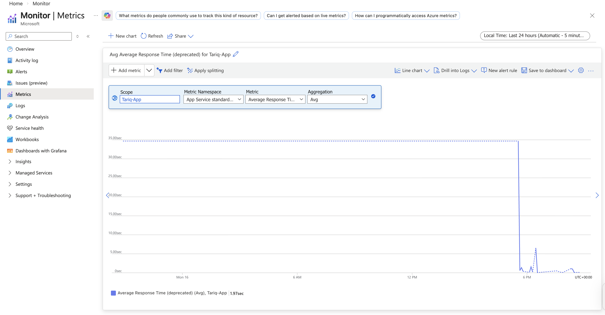
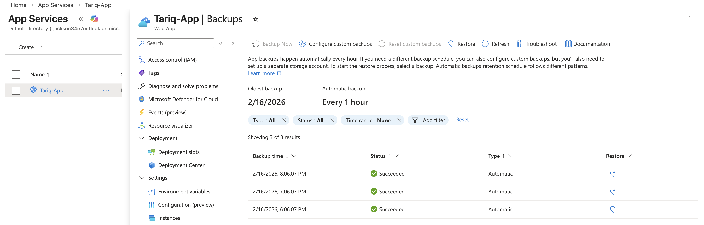
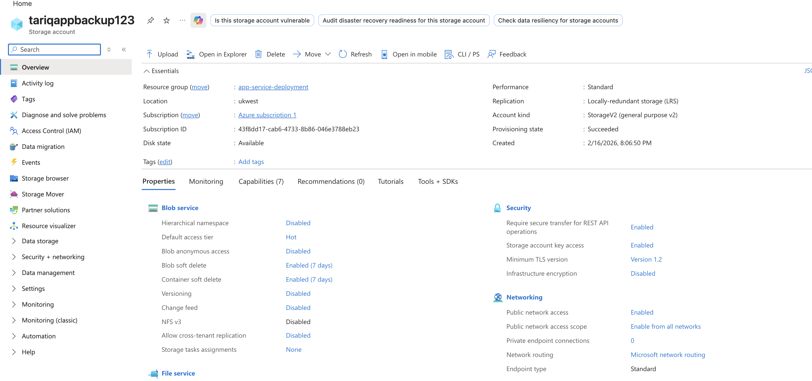

## 🚀 Azure App Service CI/CD + Staging + Autoscale Lab

This project demonstrates a real-world Azure cloud deployment pipeline for a Python web application, focusing on production grade practices such as CI/CD, staged deployments, autoscaling, monitoring, alerting, and backup strategy.  

The goal of this lab was to simulate how modern teams deploy, scale, monitor, and protect applications running on Azure App Service.

## 🧩 Architecture Overview

**Core Components:**
- Azure App Service (Linux) – Hosts the Python web app  
- App Service Plan – Defines compute, scaling, and pricing tier  
- GitHub Actions – CI/CD pipeline for build & deployment  
- Deployment Slots – Staging environment for safe releases  
- Azure Monitor – Metrics and alerts  
- Azure Autoscale – CPU-based scaling rules  
- Azure Backup – Automated backups to Storage Account  

**Workflow:**
1. Code pushed to GitHub  
2. GitHub Actions builds the app  
3. App is deployed to Azure App Service  
4. Staging slot used for pre-production validation  
5. Slot swap promotes staging to production  
6. Autoscale rules adjust capacity based on CPU load  
7. Alerts trigger on performance degradation  
8. Backups protect application state  

## ✅ CI/CD: GitHub Actions Deployment

Automated CI/CD pipeline builds and deploys the Python app to Azure App Service whenever code is pushed to `main`.

**What this demonstrates:**
- Automated build & deployment  
- No manual Azure portal uploads  
- Real-world DevOps workflow  

## ✅ Azure Deployment Center Verification

Azure Deployment Center confirms successful deployment from GitHub Actions.

**Why this matters:**
- Confirms Azure received and activated the deployment  
- Validates CI/CD integration with Azure App Service  

## 🌍 Application Running in Production

The application is publicly accessible via Azure App Service URL.

**Outcome:**
- Confirms the pipeline successfully deployed a working application  
- Demonstrates real production hosting in Azure  

## 🔁 Deployment Slots (Staging Environment)

A staging slot was created to allow safe testing before production deployment.

**Benefits of slots:**
- Test new versions before going live  
- Zero-downtime deployments  
- Blue/Green deployment strategy  

## 🔄 Slot Swap via GitHub Actions

GitHub Actions was configured to deploy to the **staging slot** and then swap to production.

**Why this is important:**
- Enables safer releases  
- Prevents broken builds from reaching users  
- Mirrors real enterprise deployment patterns  

## 📈 Autoscaling (CPU-Based Rules)

Azure Autoscale was configured to dynamically adjust instance count based on CPU usage.

**Scale Out Rule (High CPU)**

**Scale In Rule (Low CPU)**

**What this demonstrates:**
- Automatic performance scaling  
- Cost-efficiency during low traffic  
- Resilience during traffic spikes  

## 🚨 Performance Alerting

An alert rule was created to notify when average response time exceeds a threshold.

**Why this matters:**
- Proactive monitoring  
- Detects performance degradation  
- Enables faster incident response  

## 📊 Application Metrics & Observability

Azure Monitor Metrics were used to track application performance.

**Monitored metrics include:**
- Response time  
- CPU usage  
- Request trends  

## 💾 Backup & Recovery Strategy

Automated backups were configured to protect the application.

**Backup Configuration**

**Backup Created**

**Why this matters:**
- Disaster recovery readiness  
- Protects against accidental deletion  
- Supports rollback scenarios  

## 🧠 Skills Demonstrated

- Azure App Service (Linux)  
- GitHub Actions CI/CD  
- Deployment Slots (Staging → Production)  
- Blue-Green Deployments  
- Autoscaling (CPU metrics)  
- Azure Monitor & Alerts  
- Backup & Restore Strategy  
- Cloud Cost Management  
- Production-Ready Cloud Architecture  

## 🎯 Key Takeaways

This project simulates how modern cloud-native applications are deployed and operated in production environments. It demonstrates not just deployment, but also **reliability, scalability, monitoring, alerting, and recovery**, aligning with real-world DevOps and Cloud Engineer responsibilities.
